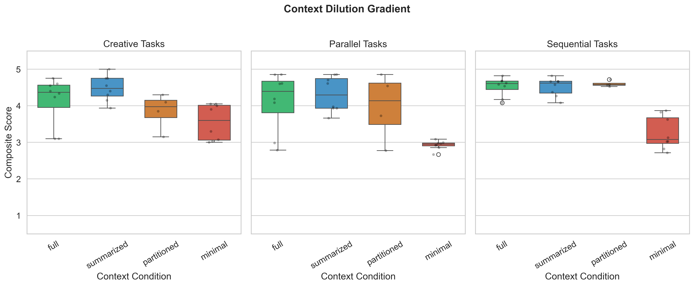
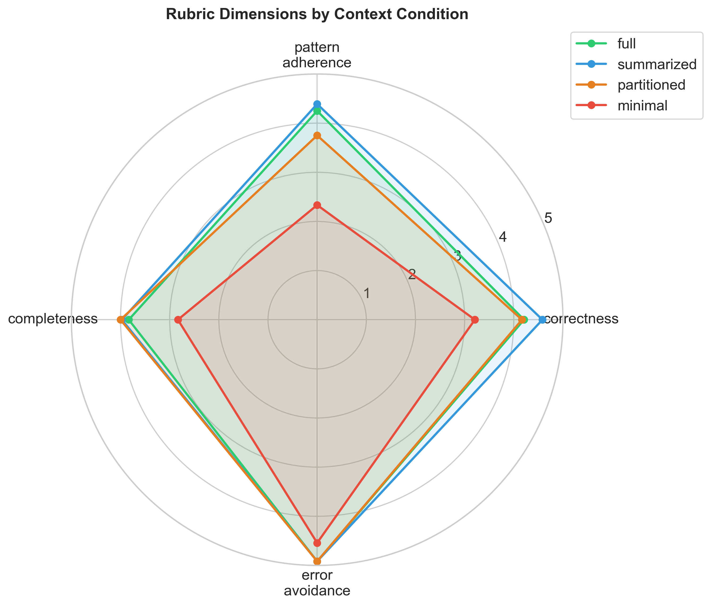
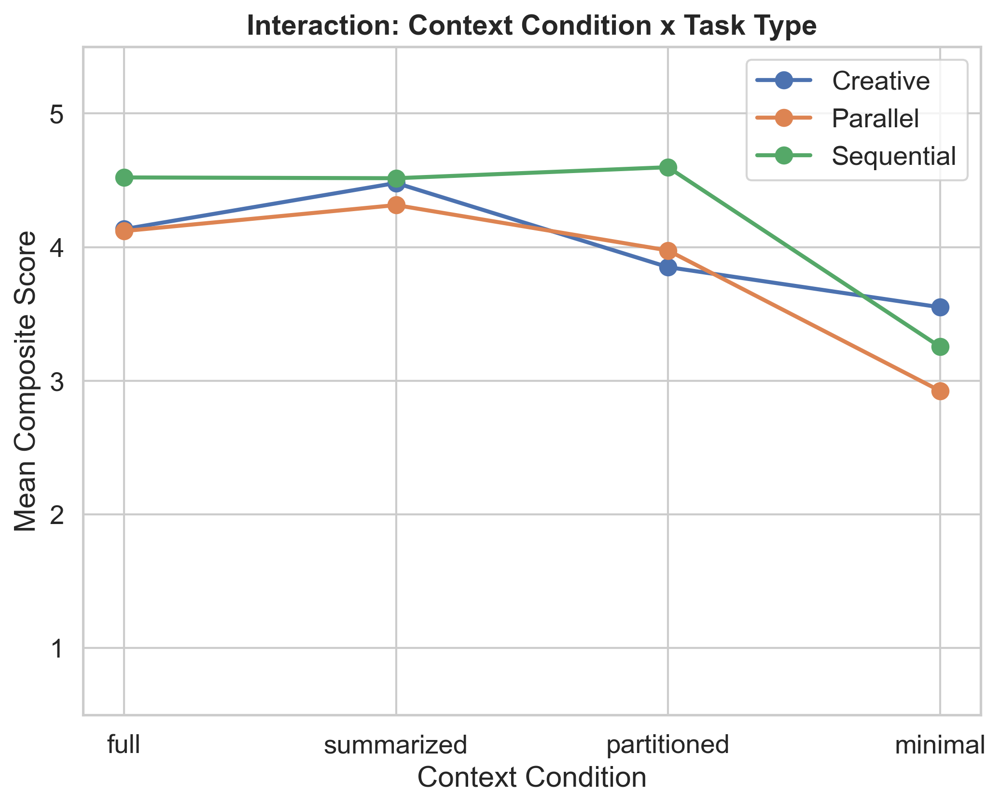

# Preliminary Findings: Context Dilution Is Real, Measurable, and Predictable

**Michael Golden**
**April 2026**

---

In the [original article](https://www.michaelfgolden.com/ideas/solo-pair-or-swarm-context-dilution-and-the-real-cost-of-multi-agent-orchestration), I made a structural argument: distributing a task's context across multiple AI agents degrades output quality because each agent inherits only a fragment of the shared understanding built during a conversation. I called this *context dilution*. The argument was logical, grounded in years of watching the same phenomenon play out in human engineering teams, but I was curious to discover if I could create an experiment to test the theory. 

## The Experiment

We ran 84 controlled trials across a factorial design: 12 coding tasks, 4 context conditions, 2 agent configurations. Each task was drawn from two synthetic Python codebases with embedded conversation histories containing corrections, clarifications, architectural decisions, and rejected approaches. The subject model was Qwen 2.5 Coder 14B, judged by Qwen 2.5 32B on a structured 4-dimension rubric, with all inference running locally via Ollama on an M1 Max.

The core manipulation was simple. We gave the same tasks to agents with progressively less context:

| Condition | What the Agent Sees |
|-----------|-------------------|
| **Full** | Complete 20-message conversation history + all codebase files |
| **Summarized** | LLM-generated summary of conversation + all files |
| **Partitioned** | Only the agent's assigned files, no conversation |
| **Minimal** | Task description only — no files, no history |

If context dilution is real, scores should degrade as context thins. They did.

## The Gradient

| Condition | Mean Composite Score |
|-----------|---------------------|
| Summarized | 4.44 |
| Full | 4.26 |
| Partitioned | 4.14 |
| Minimal | 3.24 |

The Jonckheere-Terpstra test for ordered monotonic degradation came back significant at p < 0.000001. The effect isn't subtle. Full context to minimal context is a **1.0-point drop on a 5-point scale**, with a Cliff's delta of 0.81 (95% CI: 0.60–0.97). By any standard, that's a large effect.

The pairwise comparisons sharpen the picture. The drop from full to summarized? Not significant (p = 0.73). The drop from summarized to partitioned? Not significant (p = 0.10). But the drop from partitioned to minimal? Highly significant (p = 0.0003). The cliff isn't gradual. There's a threshold — once you strip the codebase files and leave only the task description, quality falls off a ledge.

## What Breaks First

Not everything degrades equally. The radar chart tells the story dimension by dimension:

| Dimension | Full | Minimal | Drop |
|-----------|------|---------|------|
| Pattern adherence | 4.25 | 2.33 | **-1.92** |
| Completeness | 3.83 | 2.83 | -1.00 |
| Correctness | 4.21 | 3.21 | -1.00 |
| Error avoidance | 4.92 | 4.54 | -0.38 |

Pattern adherence collapses first and hardest — nearly a 2-point drop. This makes intuitive sense. When the conversation says "don't use raw SQL, we use SQLAlchemy throughout" and the agent never sees that conversation, it has no way to know. The codebase conventions, the naming patterns, the architectural decisions that accumulated over 20 messages — these are exactly the signals that vanish when context is diluted.

Error avoidance, by contrast, barely moves. Models already have strong priors against obviously bad patterns. You don't need a conversation history to know not to add caching to a function that explicitly warns against it in a docstring. But knowing to use the Customer model when the business calls them "Users"? That requires the conversation.

## The Task Type Surprise

The original article hypothesized that sequential reasoning tasks (debugging, tracing data flows) would be most sensitive to context dilution because understanding accumulates linearly, while parallel tasks (auditing, batch refactoring) would be least sensitive because sub-tasks are self-contained.

The data tells a different story.

| Task Type | Full | Minimal | Drop |
|-----------|------|---------|------|
| Parallel | 4.12 | 2.92 | **-1.20** |
| Sequential | 4.52 | 3.25 | -1.27 |
| Creative | 4.13 | 3.55 | -0.58 |

Parallel tasks hit nearly as hard as sequential, and the interaction plot reveals why. Parallel tasks — auditing validation coverage, refactoring output layers — seem self-contained, but they depend heavily on codebase conventions that are only established in the conversation. "Use Protocol, not ABC." "Don't use pandas." "Validation happens only in the ingest layer." Strip the conversation and the agent doesn't know any of this. The task *looks* parallelizable, but the conventions that constrain the solution are not.

Creative tasks proved most resilient, likely because they're more open-ended. There's no single correct answer to "design a REST API," so even without conversation context, the model can produce a reasonable design. It just won't match the codebase's style.

## Summarization Works (Surprisingly Well)

The summarized condition didn't just hold up against full context — it slightly outperformed it (4.44 vs 4.26, though the difference isn't significant). This runs counter to the expectation that summarization always loses information.

Looking at the summarizer retention analysis, the Llama 3.2 summarizer preserved 67–83% of keyword-level context, with clarifications retained best (92%) and corrections worst (65%). Despite losing a third of the raw information, the summary was more information-dense than the raw 20-message history. The conversation included pleasantries, acknowledgments, and repetition — noise that the summary stripped away.

The implication for practitioners: if you're going to hand off context between agents, a well-crafted summary may actually outperform dumping the full conversation. Compress, don't just copy.

## Single Agent vs. Multi-Agent: A Non-Result

One finding that surprised me: the single-agent and multi-agent configurations scored almost identically across all conditions.

| Config | Full | Summarized | Minimal |
|--------|------|------------|---------|
| Single | 4.27 | 4.46 | 3.27 |
| Multi (2 agents + merge) | 4.25 | 4.41 | 3.22 |

The two-phase merge protocol (structured merge + critique/refine) appears to have neutralized the coordination overhead that the original article predicted would degrade multi-agent performance. This is actually good news for orchestration — it suggests that the quality loss comes from *what context each agent receives*, not from *splitting the work itself*. If you can give each sub-agent sufficient context, the merge step doesn't lose much.

## Judge Reliability

The three judge replicas achieved Krippendorff's alpha > 0.99 on all four dimensions — near-perfect agreement. This is a consequence of temperature=0.0 producing near-deterministic outputs. It validates reproducibility but means the replicas aren't providing independent signal. A future run should use temperature > 0 for the judge to test robustness.

## What This Means

Three things stand out from this preliminary data:

**Context dilution is real and large.** A 1-point drop on a 5-point scale between full and minimal context, with p < 0.000001. This isn't noise. The structural argument from the original article holds up under empirical scrutiny.

**The cliff is at "minimal," not at "summarized."** The practical implication is that you don't need to preserve every message from a conversation to maintain quality. You need to preserve the *substance* — the corrections, decisions, and constraints. A summary does this. Stripping context entirely doesn't.

**Pattern adherence is the canary.** When context dilution degrades output, it shows up first and worst in codebase convention violations. The model can still produce correct code, but it won't match your style, your patterns, or your architectural decisions. This is exactly the kind of subtle quality loss that passes a code review at first glance but accumulates as technical debt.

## Limitations

This is N=1 per cell — a pilot. The trends are clear and statistically significant due to the large effect size, but the confidence intervals are wide. A larger run (N=5 or N=10) would tighten the estimates, particularly for the interaction effects between task type and condition. The codebases and conversations are synthetic, the judge is same-family (Qwen judging Qwen), and we don't yet have human evaluation data to calibrate against. These results should be treated as directionally strong but not publication-ready.

## What's Next

The infrastructure is in place for a full N=15 run with human evaluation calibration. The immediate questions to answer:

1. Does the summarized-beats-full pattern hold with more trials, or is it noise?
2. Which specific context types (corrections vs. decisions vs. rejections) predict the largest quality drops when removed?
3. Does human evaluation agree with the LLM judge, particularly on pattern adherence?

The data is heading in an interesting direction. More to come.
